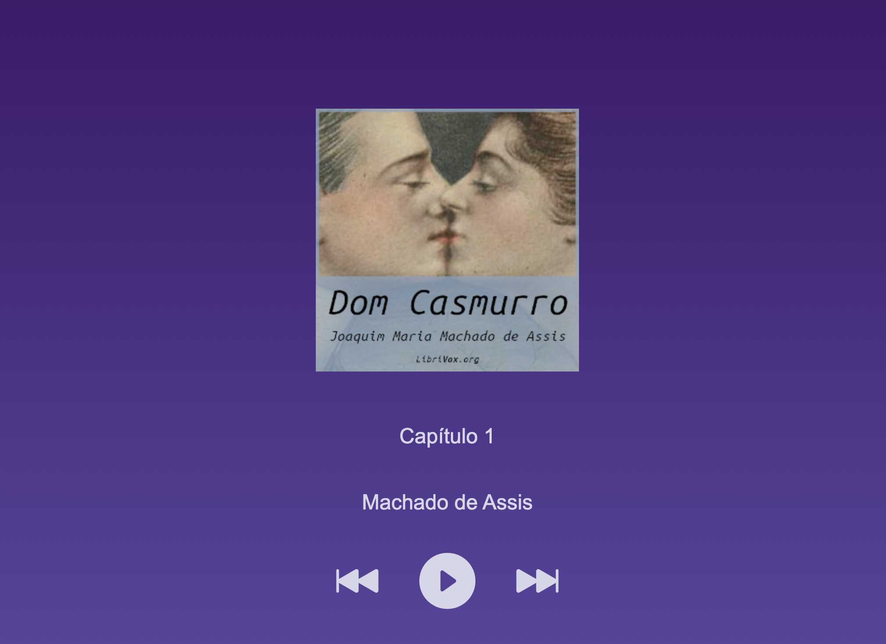

# Projeto Audiobook

## Projeto Intensivão de JavaScript da <a href=" https://www.hashtagtreinamentos.com/"> Hashtag Treinamentos</a>

### Projeto desenvolvido durante as aulas do intensivão Javascript.

- Deploy: [Audiobook](https://amandaahellen.github.io/Project-Audiobook/)

## Índice

- <a href="#sobre-o-projeto">Sobre o projeto</a>
- <a href="#layout">Layout</a>
- <a href="#tecnologias-utilizadas">Tecnologias utilizadas</a>
- <a href="#desenvolvido-por"> Desenvolvido por</a>

## 📝Sobre o projeto

Este repositório foi criado para o projeto do Intensivão de JavaScript da Hashtag Treinamentos. Trata-se de um sistema tocador de audiobook com um clássico da literatura brasileira, o Dom Casmurro do famoso Machado de Assis.

O tocador de audiobook proporciona uma experiência completa, permitindo que o usuário navegue pelos capítulos do livro e controle a reprodução (play, pause, avanço ou retroceder), podendo desfrutar da obra de Machado de Assis.

## 💻Layout

## 🛠Tecnologias utilizadas

 
 
 

## 👩🏽‍💻Desenvolvido por

### `Amanda Hellen` durante o <strong>Intensivão de JavaScript</strong> da Programação da Hashtag Treinamentos.
